# Local Growth OS - ER Diagram (Entity Relationship)

## Overview

This document provides the complete Entity Relationship Diagram for Local Growth OS in Mermaid format, showing all entities, relationships, cardinalities, and key attributes.

---

## Complete ER Diagram

```mermaid
erDiagram
    TENANTS ||--o{ LOCATIONS : has
    TENANTS ||--o{ PROFILES : employs
    TENANTS ||--o{ CONTACTS : manages
    TENANTS ||--o{ PIPELINES : defines
    TENANTS ||--o{ WORKFLOWS : automates
    TENANTS ||--o{ MESSAGE_TEMPLATES : uses
    TENANTS ||--o{ REVIEW_PLATFORMS : connects
    TENANTS ||--o{ CAMPAIGNS : runs
    TENANTS ||--o{ SUBSCRIPTIONS : subscribes
    TENANTS ||--o{ INVOICES : billed
    
    LOCATIONS ||--o{ CONTACTS : serves
    LOCATIONS ||--o{ APPOINTMENTS : hosts
    LOCATIONS ||--o{ REVIEW_PLATFORMS : linked
    
    PROFILES ||--o{ CONTACTS : assigned_to
    PROFILES ||--o{ NOTES : creates
    PROFILES ||--o{ CONVERSATIONS : participates
    PROFILES ||--o{ APPOINTMENTS : provides
    PROFILES ||--o{ ROLES : assigned
    
    CONTACTS ||--o{ CONTACT_ACTIVITIES : generates
    CONTACTS ||--o{ NOTES : has
    CONTACTS ||--o{ SMS_MESSAGES : receives
    CONTACTS ||--o{ EMAIL_MESSAGES : receives
    CONTACTS ||--o{ CONVERSATIONS : participates
    CONTACTS ||--o{ REVIEWS : writes
    CONTACTS ||--o{ REVIEW_REQUESTS : receives
    CONTACTS ||--o{ APPOINTMENTS : books
    CONTACTS ||--o{ CAMPAIGN_RECIPIENTS : targeted
    
    PIPELINES ||--o{ PIPELINE_STAGES : contains
    PIPELINE_STAGES ||--o{ CONTACTS : categorized_in
    
    WORKFLOWS ||--o{ WORKFLOW_EXECUTIONS : triggers
    WORKFLOW_EXECUTIONS ||--o{ WORKFLOW_EXECUTION_LOGS : logs
    WORKFLOW_EXECUTIONS ||--o{ CONTACTS : targets
    
    CONVERSATIONS ||--o{ SMS_MESSAGES : contains
    CONVERSATIONS ||--o{ EMAIL_MESSAGES : contains
    CONVERSATIONS ||--o{ CONVERSATION_PARTICIPANTS : includes
    
    REVIEW_PLATFORMS ||--o{ REVIEWS : fetches
    
    CAMPAIGNS ||--o{ CAMPAIGN_RECIPIENTS : targets
    MESSAGE_TEMPLATES ||--o{ CAMPAIGNS : used_in
    MESSAGE_TEMPLATES ||--o{ REVIEW_REQUESTS : used_in
    
    APPOINTMENTS ||--o{ CONTACTS : scheduled_for
    
    SUBSCRIPTIONS ||--o{ USAGE_TRACKING : tracks

    TENANTS {
        uuid id PK
        varchar name
        varchar slug UK
        varchar industry
        varchar status
        varchar subscription_tier
        varchar stripe_customer_id
        jsonb settings
        jsonb branding
        timestamptz created_at
    }
    
    LOCATIONS {
        uuid id PK
        uuid tenant_id FK
        varchar name
        varchar address_line1
        varchar city
        varchar postal_code
        varchar phone
        varchar google_place_id
        boolean is_primary
    }
    
    PROFILES {
        uuid id PK
        uuid tenant_id FK
        varchar email
        varchar first_name
        varchar last_name
        varchar role
        varchar status
        timestamptz last_login_at
    }
    
    CONTACTS {
        uuid id PK
        uuid tenant_id FK
        varchar source
        varchar type
        varchar first_name
        varchar last_name
        varchar email
        varchar phone
        varchar status
        uuid assigned_to FK
        uuid stage_id FK
        uuid location_id FK
        integer lead_score
        jsonb custom_fields
    }
    
    PIPELINES {
        uuid id PK
        uuid tenant_id FK
        varchar name
        varchar type
        boolean is_default
    }
    
    PIPELINE_STAGES {
        uuid id PK
        uuid pipeline_id FK
        varchar name
        integer position
        integer probability
    }
    
    CONTACT_ACTIVITIES {
        uuid id PK
        uuid contact_id FK
        uuid performed_by FK
        varchar activity_type
        text body
        varchar channel
        timestamptz created_at
    }
    
    NOTES {
        uuid id PK
        uuid contact_id FK
        uuid created_by FK
        text content
        boolean is_pinned
        varchar visibility
    }
    
    WORKFLOWS {
        uuid id PK
        uuid tenant_id FK
        varchar name
        varchar type
        varchar status
        varchar trigger_type
        jsonb trigger_config
        jsonb definition
    }
    
    WORKFLOW_EXECUTIONS {
        uuid id PK
        uuid workflow_id FK
        uuid contact_id FK
        varchar status
        varchar current_node_id
        jsonb context
        timestamptz started_at
    }
    
    WORKFLOW_EXECUTION_LOGS {
        uuid id PK
        uuid execution_id FK
        varchar node_id
        varchar node_type
        varchar action_type
        varchar status
        jsonb input_data
        jsonb output_data
    }
    
    MESSAGE_TEMPLATES {
        uuid id PK
        uuid tenant_id FK
        varchar name
        varchar type
        varchar category
        text content
        text[] variables
    }
    
    SMS_MESSAGES {
        uuid id PK
        uuid tenant_id FK
        uuid contact_id FK
        uuid conversation_id FK
        varchar from_number
        varchar to_number
        text body
        varchar direction
        varchar status
        varchar provider_message_id
    }
    
    EMAIL_MESSAGES {
        uuid id PK
        uuid tenant_id FK
        uuid contact_id FK
        uuid conversation_id FK
        varchar from_email
        varchar to_email
        varchar subject
        text body_html
        varchar direction
        varchar status
        integer open_count
    }
    
    CONVERSATIONS {
        uuid id PK
        uuid tenant_id FK
        uuid contact_id FK
        varchar channel
        varchar status
        uuid assigned_to FK
        timestamptz last_message_at
        integer unread_count
    }
    
    CONVERSATION_PARTICIPANTS {
        uuid id PK
        uuid conversation_id FK
        uuid profile_id FK
        varchar role
    }
    
    REVIEW_PLATFORMS {
        uuid id PK
        uuid tenant_id FK
        varchar platform
        uuid location_id FK
        varchar platform_account_id
        varchar status
        timestamptz last_synced_at
    }
    
    REVIEWS {
        uuid id PK
        uuid tenant_id FK
        varchar platform
        varchar platform_review_id
        uuid contact_id FK
        varchar reviewer_name
        integer rating
        text content
        text response_content
        timestamptz published_at
    }
    
    REVIEW_REQUESTS {
        uuid id PK
        uuid tenant_id FK
        uuid contact_id FK
        varchar channel
        varchar status
        text review_link_url
        timestamptz sent_at
    }
    
    APPOINTMENTS {
        uuid id PK
        uuid tenant_id FK
        uuid contact_id FK
        uuid service_provider_id FK
        varchar title
        timestamptz start_time
        timestamptz end_time
        varchar status
        varchar booking_source
    }
    
    CAMPAIGNS {
        uuid id PK
        uuid tenant_id FK
        varchar name
        varchar type
        varchar channel
        varchar status
        integer total_recipients
        integer total_sent
        timestamptz started_at
    }
    
    CAMPAIGN_RECIPIENTS {
        uuid id PK
        uuid campaign_id FK
        uuid contact_id FK
        varchar status
        timestamptz sent_at
        timestamptz opened_at
        timestamptz clicked_at
    }
    
    SUBSCRIPTIONS {
        uuid id PK
        uuid tenant_id FK
        varchar stripe_subscription_id
        varchar status
        timestamptz current_period_start
        timestamptz current_period_end
    }
    
    USAGE_TRACKING {
        uuid id PK
        uuid tenant_id FK
        date period_start
        integer contacts_count
        integer sms_sent
        integer emails_sent
    }
    
    INVOICES {
        uuid id PK
        uuid tenant_id FK
        varchar stripe_invoice_id
        integer amount_cents
        varchar status
        date period_start
        date period_end
    }
```



---

## Relationship Details

### One-to-Many Relationships

| Parent Entity | Child Entity | Cardinality | Description |
|--------------|--------------|-------------|-------------|
| TENANTS | LOCATIONS | 1:N | Each tenant can have multiple business locations |
| TENANTS | PROFILES | 1:N | Each tenant employs multiple team members |
| TENANTS | CONTACTS | 1:N | Each tenant manages multiple leads/customers |
| TENANTS | PIPELINES | 1:N | Each tenant can define multiple sales pipelines |
| TENANTS | WORKFLOWS | 1:N | Each tenant can create multiple automation workflows |
| TENANTS | MESSAGE_TEMPLATES | 1:N | Each tenant can store multiple message templates |
| TENANTS | REVIEW_PLATFORMS | 1:N | Each tenant can connect multiple review platforms |
| TENANTS | CAMPAIGNS | 1:N | Each tenant can run multiple marketing campaigns |
| PIPELINES | PIPELINE_STAGES | 1:N | Each pipeline contains multiple stages |
| PIPELINE_STAGES | CONTACTS | 1:N | Each stage can contain multiple contacts |
| CONTACTS | CONTACT_ACTIVITIES | 1:N | Each contact can have multiple activities logged |
| CONTACTS | NOTES | 1:N | Each contact can have multiple notes |
| CONTACTS | SMS_MESSAGES | 1:N | Each contact can receive multiple SMS messages |
| CONTACTS | EMAIL_MESSAGES | 1:N | Each contact can receive multiple emails |
| CONTACTS | APPOINTMENTS | 1:N | Each contact can book multiple appointments |
| CONTACTS | REVIEWS | 1:N | Each contact can leave multiple reviews |
| CONTACTS | REVIEW_REQUESTS | 1:N | Each contact can receive multiple review requests |
| WORKFLOWS | WORKFLOW_EXECUTIONS | 1:N | Each workflow can have multiple execution instances |
| WORKFLOW_EXECUTIONS | WORKFLOW_EXECUTION_LOGS | 1:N | Each execution generates multiple log entries |
| CONVERSATIONS | SMS_MESSAGES | 1:N | Each conversation can contain multiple SMS messages |
| CONVERSATIONS | EMAIL_MESSAGES | 1:N | Each conversation can contain multiple emails |
| CONVERSATIONS | CONVERSATION_PARTICIPANTS | 1:N | Each conversation can have multiple participants |
| REVIEW_PLATFORMS | REVIEWS | 1:N | Each platform connection fetches multiple reviews |
| CAMPAIGNS | CAMPAIGN_RECIPIENTS | 1:N | Each campaign targets multiple recipients |

### Many-to-Many Relationships

| Entity A | Junction Table | Entity B | Description |
|----------|---------------|----------|-------------|
| PROFILES | CONVERSATION_PARTICIPANTS | CONVERSATIONS | Team members participate in conversations |
| PROFILES | TEAM_LOCATION_ASSIGNMENTS | LOCATIONS | Team members assigned to locations |
| CAMPAIGNS | CAMPAIGN_RECIPIENTS | CONTACTS | Campaigns target multiple contacts |

---

## Key Entity Groups

### Core Business Entities
- **TENANTS** - Central entity, all others belong to a tenant
- **LOCATIONS** - Physical business locations
- **PROFILES** - Team members/users
- **SUBSCRIPTIONS** - Billing and plan information

### Lead Management Entities
- **CONTACTS** - Leads and customers
- **PIPELINES** - Sales pipeline definitions
- **PIPELINE_STAGES** - Stages within pipelines
- **CONTACT_ACTIVITIES** - Activity timeline
- **NOTES** - Internal notes on contacts

### Automation Entities
- **WORKFLOWS** - Automation definitions
- **WORKFLOW_EXECUTIONS** - Running/completed workflow instances
- **WORKFLOW_EXECUTION_LOGS** - Detailed execution logs
- **MESSAGE_TEMPLATES** - Reusable message templates

### Communication Entities
- **CONVERSATIONS** - Unified conversation threads
- **SMS_MESSAGES** - SMS message records
- **EMAIL_MESSAGES** - Email message records
- **CONVERSATION_PARTICIPANTS** - Team members in conversations

### Review Management Entities
- **REVIEW_PLATFORMS** - Connected review sources
- **REVIEWS** - Collected reviews
- **REVIEW_REQUESTS** - Requests sent to customers

### Marketing Entities
- **CAMPAIGNS** - Broadcast/drip campaigns
- **CAMPAIGN_RECIPIENTS** - Individual recipient tracking

### Scheduling Entities
- **APPOINTMENTS** - Scheduled meetings/services

### Analytics Entities
- **USAGE_TRACKING** - Tenant usage metrics
- **INVOICES** - Billing records

---

## Data Flow Patterns

### Lead Capture Flow
```
External Source → CONTACTS created → CONTACT_ACTIVITIES logged
                      ↓
              Assigned to PIPELINE_STAGES
                      ↓
              WORKFLOWS triggered → WORKFLOW_EXECUTIONS
                      ↓
              SMS_MESSAGES/EMAIL_MESSAGES sent
```

### Review Management Flow
```
REVIEW_PLATFORMS connected → REVIEWS fetched → Stored in database
                                      ↓
                              Negative review? → Alert PROFILES
                                      ↓
                              PROFILES respond → REVIEWS.response_content updated
```

### Campaign Flow
```
CAMPAIGNS created → CAMPAIGN_RECIPIENTS generated → Messages sent
                        ↓                              ↓
                Track opens/clicks              Update CAMPAIGN_RECIPIENTS.status
                        ↓                              ↓
                Update CAMPAIGNS metrics      Log to CONTACT_ACTIVITIES
```

### Conversation Flow
```
Incoming Message → SMS_MESSAGES/EMAIL_MESSAGES created
                        ↓
                CONVERSATIONS found or created
                        ↓
                CONVERSATION_PARTICIPANTS notified
                        ↓
                PROFILES respond → Outgoing message created
```

---

## Indexing Strategy by Entity

### High-Write Tables (Optimize for INSERT)
- `CONTACT_ACTIVITIES` - Minimal indexes, time-series data
- `WORKFLOW_EXECUTION_LOGS` - Partition by date
- `SMS_MESSAGES` - Index on tenant_id + created_at
- `EMAIL_MESSAGES` - Index on tenant_id + created_at

### High-Read Tables (Optimize for SELECT)
- `CONTACTS` - Multiple composite indexes for filtering
- `CONVERSATIONS` - Index on last_message_at for inbox ordering
- `REVIEWS` - Index on rating and published_at

### Lookup Tables (Small, Frequently Joined)
- `PIPELINE_STAGES` - Index on pipeline_id + position
- `LOCATIONS` - Index on tenant_id

---

## Normalization Level

The schema follows **Third Normal Form (3NF)** with strategic denormalization:

### Normalized (3NF)
- All non-key attributes depend on the primary key
- No transitive dependencies
- Separate tables for related entities

### Strategic Denormalization
- `CONTACTS` stores `assigned_to` (profile_id) directly instead of junction table
- `CONVERSATIONS` stores `last_message_at` and `unread_count` (calculated fields)
- `CAMPAIGNS` stores aggregate counts (total_sent, total_opened)
- `daily_metrics` table for pre-aggregated analytics

---

## Data Volume Estimates (at Scale)

| Entity | Estimated Rows (10K tenants) | Growth Rate |
|--------|------------------------------|-------------|
| TENANTS | 10,000 | +500/month |
| PROFILES | 50,000 | +2,500/month |
| CONTACTS | 50,000,000 | +5M/month |
| CONTACT_ACTIVITIES | 500,000,000 | +50M/month |
| SMS_MESSAGES | 200,000,000 | +20M/month |
| EMAIL_MESSAGES | 300,000,000 | +30M/month |
| CONVERSATIONS | 100,000,000 | +10M/month |
| WORKFLOW_EXECUTIONS | 1,000,000,000 | +100M/month |
| REVIEWS | 50,000,000 | +5M/month |

**Note:** Tables exceeding 100M rows should be partitioned by date.

---

## Foreign Key Constraints

All foreign keys use:
- `ON DELETE CASCADE` for child entities that shouldn't exist without parent
- `ON DELETE SET NULL` for optional relationships
- `ON UPDATE CASCADE` for primary key changes (rare)

### Critical Cascades
- Tenant deletion → All tenant data deleted
- Contact deletion → Activities, messages, appointments deleted
- Workflow deletion → Executions and logs deleted
- Campaign deletion → Recipients deleted

### Protected Deletes (SET NULL)
- Profile deletion → Contacts.assigned_to set NULL (reassign manually)
- Location deletion → Contacts.location_id set NULL

---

**Document Version:** 1.0  
**Last Updated:** [Current Date]  
**Author:** SaaS Architecture Team
